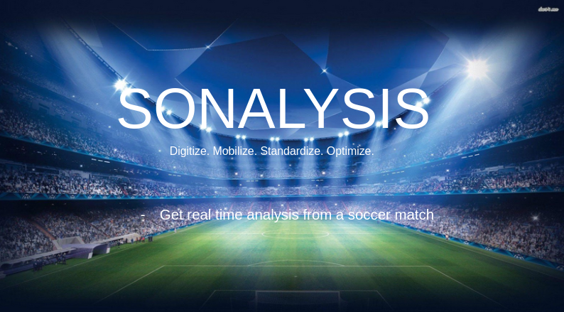

# Sonalysis Front End

Here are the process

1. Clone this work locally.

2. Install all dependencies using requirement.txt

```

pip3 install -r requirements.txt

pip3 install -r requirements-gpu.txt

```

3. download the following folders [here](https://drive.google.com/drive/folders/1Gt_yugnNg0vXUiY63V315KUuYsUSqq2P?usp=sharing).

4. Add the checkpoints folder to the root directory of this github folder.

5. Merge data/yolov3.weights with the exiting 'data' folder present in the root directory of this github folder. Such that we now have yolov3.weights in the data folder.

6. From the root directory, run this in terminal.

```
python roi_extractor.py --video ./vid/barca6.mp4 --model yolov3
```

7. You can find all exported data from the video regarding each player and a cumulative result of all players in the *exported data* folder.

      a. playerA[player number].csv (where player number starts from 1 to 10).

      b. playerB[player number].csv (where player number starts from 1 to 10).

      c. playerA Goalkeeper.csv

      d. playerB GoalKeeper.csv

      e. soccer metrics.csv (this is the overall performance of players, player's comparison).
